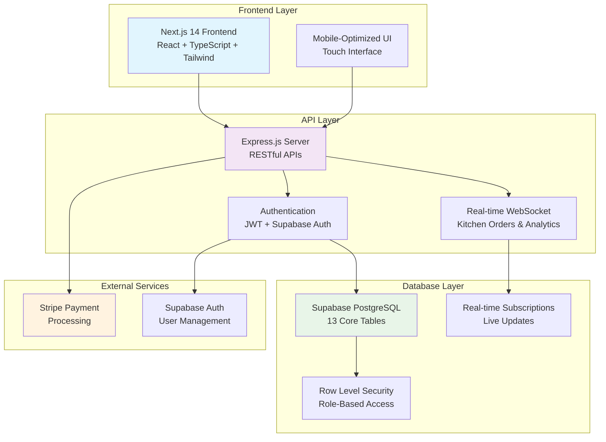

# 🍣 Fuji Restaurant POS System

Modern Point of Sale system with real-time analytics, kitchen integration, and mobile-optimized interface.

## ⚡ Quick Start

```bash
# 1. Install dependencies
npm install

# 2. Copy environment template
cp config/env.template .env.local

# 3. Update .env.local with your credentials
# (Supabase URL, keys, Stripe keys)

# 4. Run database migrations
npx supabase db push

# 5. Start development servers
npm run dev:all
```

**Access:** Frontend http://localhost:3000 | Backend http://localhost:3001

## 🏗️ System Architecture



## 🏗️ Tech Stack

- **Frontend:** Next.js 14 + TypeScript + Tailwind CSS
- **Backend:** Express.js + Supabase (PostgreSQL)
- **Payments:** Stripe integration
- **Real-time:** Supabase subscriptions

## 🏛️ Architecture Overview

### **Frontend Layer**
- **Next.js 14** with App Router for modern React development
- **TypeScript** for type safety and better developer experience
- **Tailwind CSS** for responsive, mobile-first design
- **Touch-optimized** interface for tablet/desktop POS terminals

### **API Layer**
- **Express.js** server with RESTful API endpoints
- **JWT Authentication** with Supabase Auth integration
- **Real-time WebSocket** connections for live updates
- **Role-based middleware** for secure access control

### **Database Layer**
- **Supabase PostgreSQL** with 13 core business tables
- **Row Level Security (RLS)** for data protection
- **Real-time subscriptions** for kitchen orders and analytics
- **Automated triggers** for calculations and audit logging

### **External Integrations**
- **Stripe** for secure payment processing
- **Supabase Auth** for user management and authentication
- **Real-time sync** between frontend and database

## 📁 Key Directories

```
src/
├── hooks/           # Custom React hooks for data fetching
├── lib/services/    # Business logic (Auth, Menu, Orders, Analytics)
├── server/          # Express.js API routes and middleware
├── types/           # TypeScript definitions
└── components/      # React components (ready for development)

supabase/
└── migrations/      # Database schema and sample data
```

## 🔧 Development Commands

```bash
npm run dev          # Next.js frontend only
npm run server:dev   # Express.js backend only
npm run dev:all      # Both frontend and backend
npm run build        # Production build
npm run test         # Run tests
npm run lint         # Code linting
npm run type-check   # TypeScript validation
```

## 🎯 Key Features

- **Menu Management** - Categories, items, modifiers, pricing variations
- **Order Processing** - Real-time kitchen communication and status tracking
- **Payment Processing** - Cash, credit, split payments with automatic calculations
- **Analytics Dashboard** - Sales tracking, trends, and performance metrics
- **Role-Based Access** - Admin, Manager, Server, Cashier, Kitchen, Viewer roles
- **Inventory Tracking** - Basic stock management and usage monitoring

## 🔐 Environment Variables

Required in `.env.local`:

```bash
# Supabase
NEXT_PUBLIC_SUPABASE_URL=your-project-url.supabase.co
NEXT_PUBLIC_SUPABASE_ANON_KEY=your-anon-key
SUPABASE_SERVICE_ROLE_KEY=your-service-role-key

# Stripe
STRIPE_SECRET_KEY=sk_test_your-stripe-secret-key
NEXT_PUBLIC_STRIPE_PUBLISHABLE_KEY=pk_test_your-stripe-publishable-key

# Application
NEXT_PUBLIC_APP_URL=http://localhost:3000
SESSION_SECRET=your-32-character-secret-key
```

## 📊 Database Schema

- **13 Core Tables** - Users, menu, orders, payments, analytics
- **Real-time Updates** - Kitchen orders, table status, sales data
- **Business Logic** - Automatic calculations, inventory tracking
- **Security** - Row Level Security (RLS) policies

## 🚀 Deployment

1. **Database**: Deploy migrations to Supabase
2. **Frontend**: Deploy to Vercel/Netlify
3. **Backend**: Use Vercel Edge Functions or Railway

## 🧪 Testing

- **Unit Tests**: `npm run test`
- **Coverage**: `npm run test:coverage`
- **Type Safety**: `npm run type-check`

## 📝 Documentation

- **Database Schema**: `docs/database-schema.md`
- **API Reference**: Available routes in `src/server/routes/`
- **React Hooks**: Usage examples in `src/hooks/`

---

**Status**: Foundation Complete ✅ | **Next**: Frontend Development  
**Version**: 1.0.0 | **Updated**: September 2025